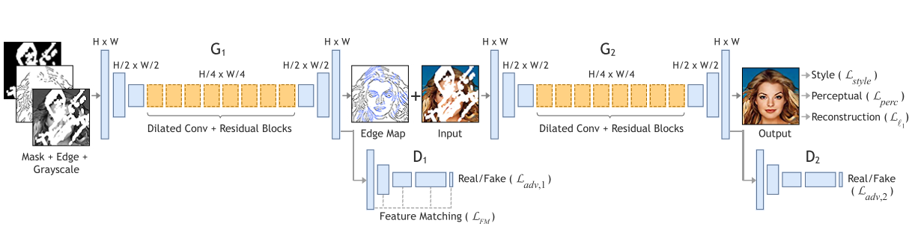

> 论文链接：https://arxiv.org/pdf/1901.00212v3.pdf

### 文章简介
19年1月新鲜出炉的image inpainting任务上的state-of-the-art（关键是还开源！！）.现阶段一般的方法，不能重构出特别合理的结构，大部分是比较模糊。Edgeconnect是一个two-stage的对抗模型，第一阶段image-to-edge后的一个边生成器，将图像缺失区域的边生成，第二阶段edge-to-image图像补全网络，以边为先验补全图像。

### 相关工作
18年深度学习处理图像修复问题有很大进展
- 1月，Adobe组，Jiahui Yu的Deepfill v1，引入attention机制用于进行image inpainting，但是限制是mask仅限于中心正方形作为遮挡，对于测试效果还是有明显的boundary artifacts，看到很明显的生成部分与原来图像部分的分界，这方面主要原因是生成修复图片结果就是将生成图片修复部分与原来部分进行直接加和。
- 4月，NVIDIA组，提出的partial-conv，可以修复irregular holes。
- 6月，Yan et al, 提出shift-net,引入shift connection layer到U-net.
- 6月，Adobe组，Jiahui Yu的Deepfill v2，提出了门控卷积(gated-conv)解决普通卷积里把所有输入像素都视为合法输入的问题，泛化了部分卷积(partial-conv)。对于所有layers中的每个channel每个空间位置提供一种可学习的动态特征选择机制。优势是可以通过素描画笔来引导inpainting，而且适用于irregular holes.

### 一些思考
- 1. 对比EdgeConnect与DeepFill v2(Free form image inpainting with gated convolution)，从训练数据分布上来说：
  - **DeepFill v2**: 由于Deepfill v2作为input的edge channel可能是ground-truth通过边缘检测生成的，与图片一起作为ground truth的一部分来监督。但是，测试阶段的时候，边缘是人为绘制的，虽然有很好的自由性，但从数据分布的角度上看，可能人为绘制出的边缘与ground truth的边缘有些差别，所以可能导致inpainting效果没有特别好。
  - **EdgeConnect**: 训练的时候用于edge-connect的边缘监督ground truth，是通过图片边缘检测得到的，然后根据幻想的边缘结果来作为先验生成补全图像，整个测试过程与训练过程从数据分布上讲是一致的，理论上如果边缘连接效果好的话，EdgeConnect的效果是要优于DeepFill v2的，但也牺牲了一些自由性。

- 2. EdgeConnect的理念是“Lines first, color next!”, 根据之前人类如何sketch物体的论文思想总结出image inpainting里面边缘其实对画画的影响比颜色大的多。但是思考点是**对于深度学习里数据分布上，rgb的数据，color next这样弱化颜色对数据影响真的好吗？**                                       

### 算法简介
作者认为相较于图像补全，边的恢复是一个更简单的任务。所以作者提出的方法在本质上是分解成缺失区域高频信息和低频信息的补全。

#### 1.边生成器
输入：$I_{gt}$ 表示ground-truth图像， $C_gt$ 表示边缘图ground-truth， $I_gray$表示ground-truth的灰度图
