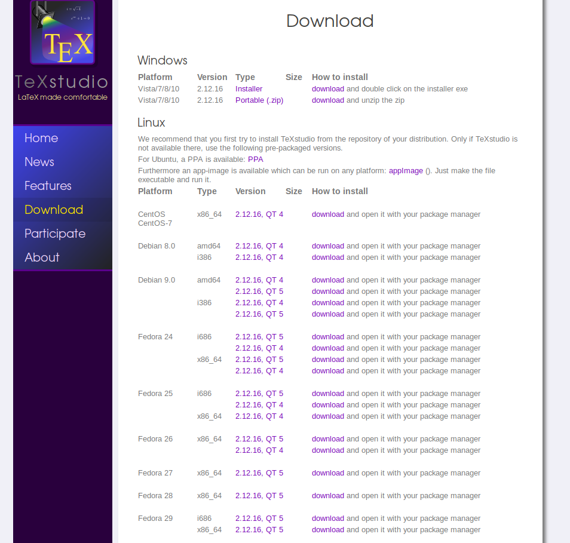
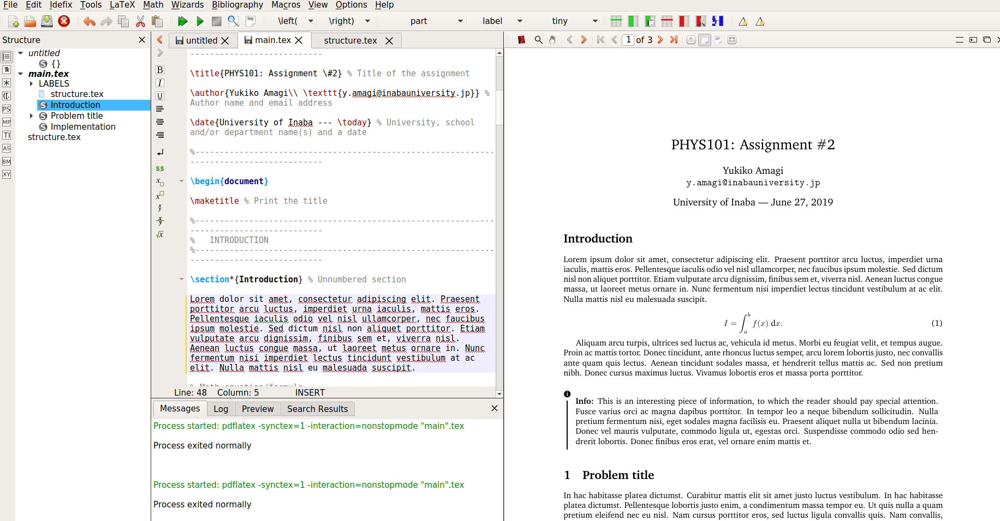

**安装Latex编辑器**

Linux环境下建议安装texstudio，界面美观，安装简单

http://texstudio.sourceforge.net/

下载对应操作系统版本的deb包



```shell
$ apt-get install texstudio_2.12.16-1+2.1_amd64.deb
```

界面



基本操作：绿色运行键

**导入相关tex package**

安装部分：
```shell
$ sudo apt-get install texlive
```

安装全部（建议但时间比较久）：
```shell
$ sudo apt-get install texlive-full
```
**Latex模板下载地址**

http://www.latextemplates.com/


**Latex学习社区**

http://www.latexstudio.net/

**中文输入问题**

对于很多基于Qt的软件，都会有这种不能输入中文的问题

如果你的输入法是ibus那么你在启动texstudio的命令前，加一些东西就可以了

```shell
$ env QT_IM_MODULE=ibus texstudio
```

当然如果你是fcitx输入法的话，就是这样
```shell
$ env QT_IM_MODULE=fcitx texstudio
```

**中文显示问题**

在输入代码里导入包下面的包就好了

```latex
\usepackage{ctex}
```
